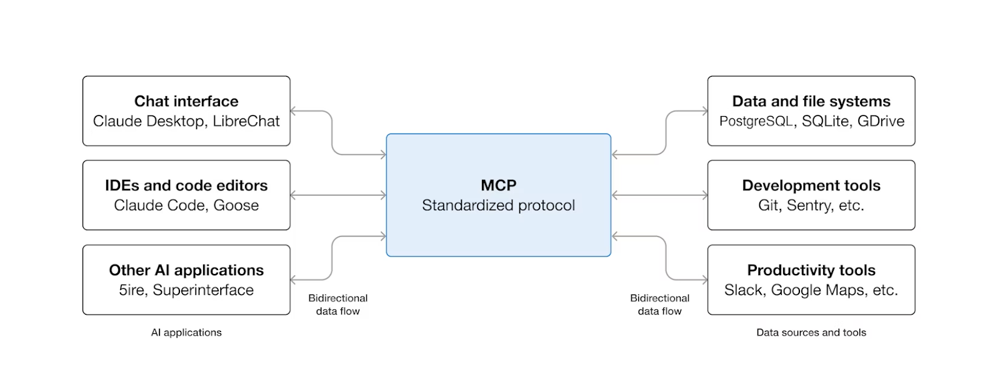

### 文章主旨

这篇文章解释了 Claude 智能体生态中的五个核心组件（Skills、Prompts、Projects、Subagents、MCP）分别解决什么问题、什么时候该用哪个，以及它们如何组合成完整工作流。

作者强调：高效的 agentic workflow 不是单靠某一个机制，而是“连接能力 + 任务执行 + 知识沉淀 + 即时指令”的组合。

### 1) Skills 是什么，什么时候用

- Skills 本质是一个文件夹，里面可包含指令、脚本、资源文件。
- Claude 会按相关性动态加载（progressive disclosure）：
  - 先加载少量元数据（metadata）判断是否匹配；
  - 匹配后再加载完整指令；
  - 需要时才加载附带文件或脚本。
- 适用场景：
  - 组织流程标准化（品牌规范、合规流程、模板）；
  - 领域能力复用（Excel、PDF、数据分析等）；
  - 个人偏好固化（写作风格、代码模式、研究方法）。

核心判断：如果你总在重复输入同一套流程性提示词（prompt），就应该把它升级成 Skill。

### 2) Prompts 是什么，什么时候用

- Prompts 是会话内的自然语言指令，偏即时、短期、一次性。
- 适合：
  - 一次性请求；
  - 在当前对话里连续微调；
  - 补充当下任务上下文。

核心判断：Prompts 负责“当下怎么做”，但不会跨会话长期复用。

### 3) Projects 是什么，什么时候用

- Projects 是带长期上下文的工作空间（知识库 + 对话历史 + 项目级指令）。
- 适合：
  - 某条业务线/项目线的长期上下文管理；
  - 团队协作与共享背景资料；
  - 在一个主题下持续进行多轮工作。

核心判断：Projects 负责“这个项目里一直要知道什么”。

### 4) Subagents 是什么，什么时候用

- Subagents 是有独立上下文窗口、独立提示词、独立工具权限的子智能体。
- 适合：
  - 任务拆分与并行执行；
  - 工具权限隔离（例如只读审查）；
  - 保持主线程上下文干净。

核心判断：Subagents 负责“把具体工作分包给专业角色执行”。

### 5) MCP 是什么，什么时候用

- MCP（Model Context Protocol）是 AI 与外部工具/数据系统连接的通用协议层。
- 适合：
  - 让 Claude 访问 Google Drive、Slack、GitHub、数据库、CRM 等；
  - 与企业内部系统做标准化接入。

核心判断：MCP 解决“连到哪里拿数据”，不负责“拿到后按什么流程处理”。

### 五者如何配合（文章给出的框架）

- **Project**：提供长期背景与任务目标。
- **MCP**：连外部数据和业务系统。
- **Skill**：提供可复用的方法论与执行标准。
- **Subagent**：承担分工与并行处理。
- **Prompt**：在当前轮次做方向微调和重点约束。

### 关键对比（可操作版本）

- Skills = Procedural knowledge（流程知识，可复用）
- Prompts = Moment instructions（即时指令）
- Projects = Persistent context（持久背景）
- Subagents = Task delegation（任务分工）
- MCP = Tool/data connectivity（工具与数据连接）

### 文章结论（中文总结）

这篇文章的核心结论是：  
要构建高质量 AI 工作流，不应把 Skills、Prompts、Projects、Subagents、MCP 视作互斥选项，而应按职责分层组合。  
其中，MCP 负责“连接”，Projects 负责“背景”，Skills 负责“方法”，Subagents 负责“执行分工”，Prompts 负责“即时控制”。

---

### 抓取说明

- 已抓取并保存文章内核心图片 2 张（主视觉 + MCP 示意图）。
- 原页面包含大量导航、推荐位与营销区块图片；本文仅保留与正文理解直接相关的图片资源。
